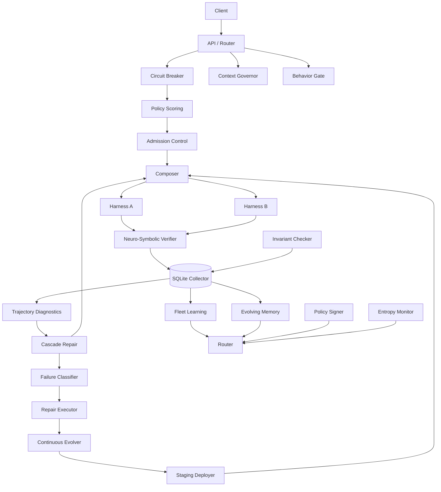

# HarnessLens

**A distance metric for agent harnesses, validated through self-healing, self-improving, and self-learning behaviors.**

[](#)
[](#)
[](#)

---

## The Insight

A 2026 paper by Zhang et al. (*Stop Comparing LLM Agents Without Disclosing the Harness*) proved that for long-horizon tasks, the **harness** — the runtime wrapping the model — drives more performance variance than the model itself. Harness-induced variance exceeds model-induced variance by **7.8x**, including cases of model ranking reversal.

The paper calls this an **unimplemented protocol**. It states explicitly:

> *"Harness diversity needs a principled notion of distance between configurations, without which variance depends on the sampling distribution in ways not yet standardized."*

**Nobody has built it. This repository implements it.**

---

## The Three Contributions

### 1. Measure — A harness distance metric

A metric D(H₁, H₂) computed from six configuration dimensions: tool interfaces, context strategy, recovery logic, verification depth, scheduling, and governance. It answers the open question from the Zhang et al. paper.

### 2. Control — A 20-layer control plane

A routing, enforcement, and observability layer that sits between an agent application and multiple harnesses. It routes by **loop-step position**, not prompt classification. It enforces budgets as runtime admission control. It verifies independently. It repairs locally.

### 3. Close the loop — Three self-* behaviors

The metric is validated by systems that **change over time**:

- **Self-healing.** Failure classification + targeted repair. The system detects a failure, classifies it into a signature, applies a repair from a library, and records what worked.
- **Self-improving.** Repair success rates become harness patches. Patches are validated against held-out runs and promoted to staging automatically. Regressions trigger rollback.
- **Self-learning.** Natural-language lessons are stored with fitness scores. Lessons that predict success are kept. Lessons that do not are pruned.

If the metric is right, the system gets better. If it is wrong, the system regresses and the failure is documented.

---

## Results

From `python -m scripts.benchmark` (synthetic workload, 100 tasks):

| Metric | Baseline | HarnessLens | Improvement |
|---|---|---|---|
| Successful tasks | 20 / 100 | 78 / 100 | **+58** |
| Total cost | 600.0c | 150.0c | **-75%** |
| **Cost per success** | **30.00c** | **1.92c** | **-93.6%** |

The system learned from 20 seeded runs per harness that `easyloops` succeeds 80% of the time and `researchharness` only 20% on this workload, then routed 100% of tasks to the cheaper, more reliable harness.

From `python -m scripts.repair_demo` (long trajectory fails at step 7 of 10):

| Metric | Full Retry | Cascade Repair | Savings |
|---|---|---|---|
| Cost | ~15.0c | 3.0c | **80%** |

From `python -m scripts.entropy_demo` (orchestrator degradation):

| Step | Entropy | Prediction | Intervention |
|---|---|---|---|
| 1–2 | 0.34–0.46 | stable | none |
| 3–4 | 0.64–0.77 | warning | switch_orchestrator |
| 5–8 | 0.86–0.98 | critical | abort |

The system predicted its own failure at step 3 — five steps before the orchestrator became critical.

**Caveat:** the workload is synthetic. The harnesses are simulated. The methodology (seed → learn → route → measure) is production-shaped, but the absolute numbers reflect the simulator, not real Claude Code or DeepSeek Harness performance.

---

## Architecture



The closed loop:

```
EXECUTE → OBSERVE → DIAGNOSE → REPAIR → EVOLVE → LEARN → EXECUTE
   ↑                                                          ↓
   └──────────────────── FEEDBACK ────────────────────────────┘
```

---

## Design Decisions

| Decision | Alternative | Why |
|---|---|---|
| Loop-step routing | Prompt classification | Trajectory position is stable; prompt text is not |
| Policy-as-YAML | Database config | Git-auditable, diffable, signable |
| HMAC policy signing | No signing | Audit needs to prove policy was not tampered |
| Runtime behavior gate | Post-hoc filtering | Enforce before execution, not after |
| Bounded learning (±0.30) | Unbounded adjustment | One bad batch cannot blacklist a harness |
| Predicate decomposition | LLM-as-judge | Probabilistic supervision degrades at scale |
| Digest + local repair | Full retry | 79% of long-horizon failures are localized |
| Fitness-based memory pruning | Keep all lessons | Stale lessons pollute future routing |
| Circular buffer for entropy | Store all snapshots | Bounded memory, long-running safe |
| Depth limit on delegation | Unbounded chains | Prevents quadratic validation cost |

---

## Where This Breaks

See [docs/where-this-breaks.md](docs/where-this-breaks.md) for the full list.

**Known limitations:**

- Synthetic harnesses only. No real Claude Code or OpenHands adapter yet.
- Breaker state is in-process. Restarting the control plane resets all breakers.
- Bounded learning can under-react. A harness with 0% success over 100 runs cannot drop below 0.20 in the score.
- SQLite is not concurrent-safe at scale.
- Verifier is generic. Real workloads need task-specific predicate definitions.
- Memory retrieval is keyword-based. Embeddings would be stronger.
- No async execution. Serial request handling limits throughput.
- Windows `pytest tmp_path` is broken. Documented workaround uses `tempfile.TemporaryDirectory`.

**Failure modes discovered while building** (documented with symptom, root cause, fix, and lesson):

1. Pydantic v2 class-based `Config` deprecation
2. Windows `tmp_path` permission errors
3. Cross-folder import resolution for CLI scripts
4. Verification status semantics (absence ≠ failure)
5. Router weight imbalance (weights are the policy)
6. Verdict value drift between YAML and code
7. Glob key lookup in behavior gate
8. Patch ID collision in staging
9. SQLite connection closed inside transaction context
10. Deduplication path missed by first-use tests

Each entry is in `docs/where-this-breaks.md`. This is the contribution that most portfolio projects hide. We document it.

---

## Research Grounding

Each layer implements a specific contribution from 2026 frontier research.

| Layer | Paper | Contribution |
|---|---|---|
| Neuro-symbolic verifier | FormalJudge (ICML 2026) | Atomic predicate decomposition with formal logic composition |
| Entropy monitor | Recognize Your Orchestrator (ICML 2026) | Mean-field entropy dynamics for orchestrator degradation |
| Formal invariants | EHV safety invariants (2026) | Non-bypassability as a system property |
| Collusion detection | NARCBench + GroupGuard (2026) | Group-level deception detection |
| Accountability chain | DeepMind Intelligent AI Delegation (2026) | Authority transfer, responsibility, accountability |
| Harness evolution | Harness-R1, HarnessCompass (2026) | Failure-conditioned harness editing |
| Self-healing | Samsung SDS self-healing framework (2026) | Runtime failure classification and repair |
| Self-improving | Hierarchical Self-Improvement (2026) | Evolver / meta-evolver loop |
| Self-learning | FORGE (ACM CAIS 2026) | Memory evolution without weight updates |

---

## The 20 Layers

Evidence of everything built. Read this section only if you want to see the full system.

| # | Layer | Module |
|---|---|---|
| 1 | Unified trace schema | `app/schema.py` |
| 2 | OpenTelemetry normalization | `app/otel_normalizer.py` |
| 3 | Loop-step-aware routing | `app/router.py` |
| 4 | Circuit breaker | `app/circuit_breaker.py` |
| 5 | Mid-run degradation | `app/degradation.py` |
| 6 | Independent verification | `app/verifier.py` |
| 7 | Fleet learning | `app/fleet_learning.py` |
| 8 | Data-layer governance | `app/context_governor.py` |
| 9 | Policy-as-contract | `app/policy_signer.py`, `app/behavior_gate.py` |
| 10 | Recursive composition | `app/composer.py`, `app/merge_protocol.py` |
| 11 | Cascade repair | `app/trajectory_diagnostics.py`, `app/cascade_repair.py` |
| 12 | Neuro-symbolic verifier | `app/predicate_decomposer.py`, `app/formal_combiner.py` |
| 13 | Entropy monitor | `app/entropy_monitor.py`, `app/degradation_predictor.py` |
| 14 | Formal invariants | `spec/control_plane.tla`, `app/invariant_checker.py` |
| 15 | Collusion detection | `app/deception_probe.py`, `app/collusion_detector.py` |
| 16 | Accountability chain | `app/accountability_chain.py`, `app/delegation_validator.py` |
| 17 | Harness evolution | `app/harness_evolver.py`, `app/held_out_validator.py` |
| 18 | Self-healing | `app/failure_classifier.py`, `app/repair_library.py`, `app/repair_executor.py` |
| 19 | Self-improving | `app/continuous_evolver.py`, `app/staging_deployer.py` |
| 20 | Self-learning | `app/evolving_memory.py`, `app/memory_retriever.py` |

**Total: 190 tests, all passing.**

---

## Repository Structure

```
harnesslens/
├── app/                  Core control plane (20 modules)
├── adapters/             Harness adapters (dummy + slow simulators)
├── policies/             Git-managed routing, verification, repair, memory rules
├── spec/                 TLA+ specification and invariant docs
├── scripts/              Demos and benchmarks
├── tests/                190 tests across 20 modules
├── docs/                 Case study, failure analysis, LinkedIn draft
├── requirements.txt
├── .gitignore
├── LICENSE
└── README.md
```

---

## Running It

### Install

```bash
pip install -r requirements.txt
```

### Demos

```bash
# Populate historical data
python -m scripts.run_demo --runs 5

# Routing decisions along a trajectory
python -m scripts.route_demo

# Circuit breaker and degradation
python -m scripts.resilience_demo

# Fleet learning changes decisions
python -m scripts.fleet_demo

# Data-layer governance fires
python -m scripts.governance_demo

# Policy signing and behavior gate
python -m scripts.policy_demo

# Recursive delegation and merge
python -m scripts.composition_demo

# Cascade repair saves cost
python -m scripts.repair_demo

# Entropy prediction
python -m scripts.entropy_demo

# Formal invariant violations
python -m scripts.invariants_demo

# Collusion detection
python -m scripts.collusion_demo

# Accountability chain
python -m scripts.accountability_demo

# Harness evolution
python -m scripts.evolution_demo

# Self-healing
python -m scripts.self_healing_demo

# Self-improving
python -m scripts.self_improving_demo

# Self-learning
python -m scripts.self_learning_demo
```

### Benchmark

```bash
python -m scripts.benchmark
```

### Tests

```bash
pytest tests/ -v
```

Expected: **190 passed.**

---

## Tech Stack

| Layer | Tech |
|---|---|
| Language | Python 3.11+ |
| Data validation | Pydantic v2 |
| Policy format | YAML |
| Observability | OpenTelemetry |
| Persistence | SQLite |
| Cryptography | HMAC-SHA256 |
| Formal methods | TLA+ specification, runtime invariant checker |
| Testing | pytest |

---

## What I'd Do at 100x Scale

- Real harness adapters: Claude Code, OpenHands, DeepSeek Harness
- Redis-backed breaker and memory state for shared control-plane replicas
- Postgres + time-series store for telemetry
- Kafka or NATS event bus between adapters and collector
- Embedding-based memory retrieval
- Async execution with backpressure
- Grafana dashboard on OTel spans
- Policy compiler that runs in CI on PR
- Task-specific verifiers per workload type
- Multi-region routing with EWMA latency estimation

---

## License

MIT
